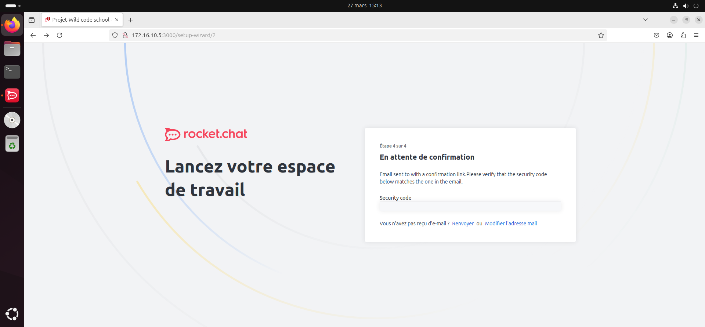

## Sommaire

1. [Prérequis technique](#prerequis-technique)
2. [Installation sur le serveur](#installation-sur-le-serveur)
3. [Création et configuration d'un compte administrateur](#creation-et-configuration-d'un-compte-administrateur)
4. [Installation sur le client](#installation-sur-le-client)
5. [FAQ](#faq)

# 1. Prérequis techniques

- Une machine serveur basée sur Linux (Ubuntu, Debian, Fedora, etc ...)
- Un processeur supportant AVX/AVX2 pour pouvoir lancer le service MongoDB qui est requis pour Rocket.Chat
- Le service Snap installé (il est préinstallé sur la plupart des distributions Linux modernes. Sinon, reportez-vous au [guide d'installation de Snaps](https://snapcraft.io/docs/installing-snapd))
# 2. Installation sur le serveur

## Déployer Rocket.Chat avec Snaps

Pour installer Rocket.Chat sur un serveur basé sur Linux on va utiliser la commande snap :

Pour la dernière version de Rocket.Chat, utilisez la commande :
>`sudo snap install rocketchat-server`
	
Si vous souhaitez installer un version précise de Rocket.Chat, utilisez cette commande :
>`sudo snap install rocketchat-server --channel=x.x/stable`

Remplacer le premier *x* par le numéro de la version majeure désirée.
Remplacer le deuxième *x* par le numéro de la version mineure désirée.

Une fois l’installation finie par snap, le service démarre automatiquement.

Il ne vous reste plus qu'à vous connecter avec une machine client par navigateur ou application en utilisant cette URL : http://172.16.10.5:3000/

# 3. Création et configuration d'un compte administrateur

Lors de la première connexion sur le serveur par navigateur ou application,
le serveur demande la création d'un compte administrateur et le paramétrage initial du serveur.

## 3a. 1ère étape - création du compte administrateur

Renseigner les information du compte administrateur.

- Nom complet : indiquer ici votre nom complet d'administrateur
- Nom utilisateur : indiquer le nom qui sera affiché sur le serveur de chat
- E-mail : indiquer l'adresse e-mail qui sera liée au compte administrateur
- Mot de passe : indiquer ici le mot de passe pour le compte administrateur

## 3b. 2ème étape - Informations sur l'organisation

Renseigner les informations de votre organisation qui va utiliser le serveur Rocket.Chat.

- Nom de l'organisation : indiquer le nom de votre organisation
- Secteur de l'organisation : indiquer le secteur lié a votre organisation 
- Taille de l'organisation : indiquer le nombre de personnes  au sein de votre organisation
- Pays : indiquer le pays où se situe votre organisation

## 3c. 3ème étape - Confirmation

Un mail de confirmation vient d’être envoyé sur l'adresse mail renseignée à la 1ère étape.
Dans ce mail vous trouverez un code de sécurité à utiliser sur la page pour valider.

Vous voilà connecté sur votre serveur Rocket.Chat en tant que Administrateur.

Pour commencer à personnaliser votre espace de travail, ajouter des utilisateurs, créer de nouveaux canaux, et gérer l'ensemble de votre serveur, référez vous à la documentation [USER_GUIDE.md](https://github.com/WildCodeSchool/TSSR-2503-P1-G2-ServeurDeChat/blob/c5851948e9ee321d73bdbf4ff8a145df496df95e/USER_GUIDE.md)

# 4. Installation sur le client

Pour utiliser Rocket.Chat sur une machine client, vous avez 2 options :

- Utiliser un navigateur web
- Utiliser l'application Rocket.Chat Desktop

## 4a. Navigateur web

Aucune installation n'est nécessaire. Ouvrez simplement votre navigateur internet et renseigner l'URL de votre serveur Rocket.Chat, par exemple : `https://open.rocket.chat`

## 4b. Rocket.chat Desktop

Télécharger et installer Rocket.Chat pour votre système d'exploitation en suivant ce lien : 
https://www.rocket.chat/download-apps

Une fois l'application installée, lancez-la et vous arrivez sur cette page :

Il vous suffit de renseigner le lien de votre serveur dans le champs disponible et de cliquer sur 'Connect'

# 5. FAQ

