# Guide d'utilisation de Rocket.Chat

Ce document présente le mode d'accès au serveur de chat, ainsi que ses principales utilisations pour les utilisateurs et l'administrateur du serveur.
## Sommaire

1. [Accès au serveur de chat](#acces)
2. [Guide utilisateur](#utilisation-client)
3. [Guide administrateur](#utilisation-admin)
4. [FAQ](#faq)

# 1. Accès au serveur de chat

Administrateur et clients peuvent se connecter à l'application de chat en se connectant à l'adresse web http://172.16.10.5:3000 depuis leur navigateur favori.

Pour que le service de chat soit disponible, il est nécessaire que la machine serveur soit en marche.

# 2. Guide utilisateur

## Connexion

Une fois connecté sur le site du serveur de chat, vous devriez vous trouver face à l'écran de connexion suivant :

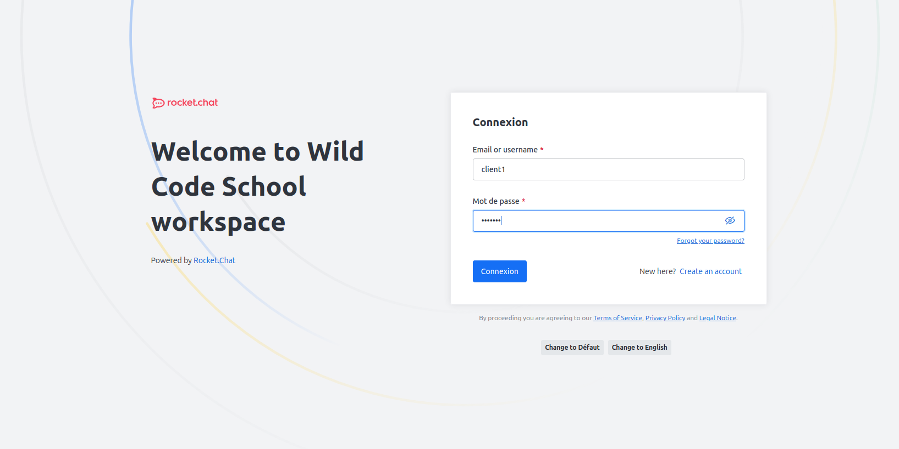

Vous pouvez y entrer votre identifiant ou votre adresse e-mail ainsi que votre mot de passe pour vous connecter.

## Salons

Une fois connecté, vous êtes renvoyé sur la page d’accueil de votre espace de chat :

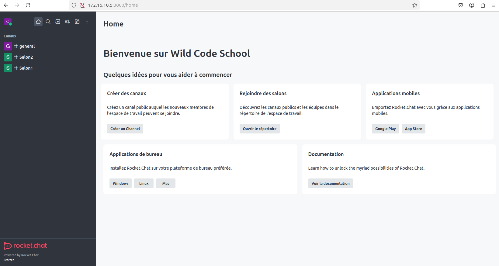

Vous pouvez naviguer sur les différents salons de chat à votre disposition dans la partie gauche de l'écran. Cliquez sur le nom d'un salon pour y accéder et commencer à chatter.

Si vous le souhaitez, vous pouvez également ajouter votre propre salon de chat en cliquant sur **Créer un channel**. Vous verrez alors apparaître la fenêtre de création de salon suivante :

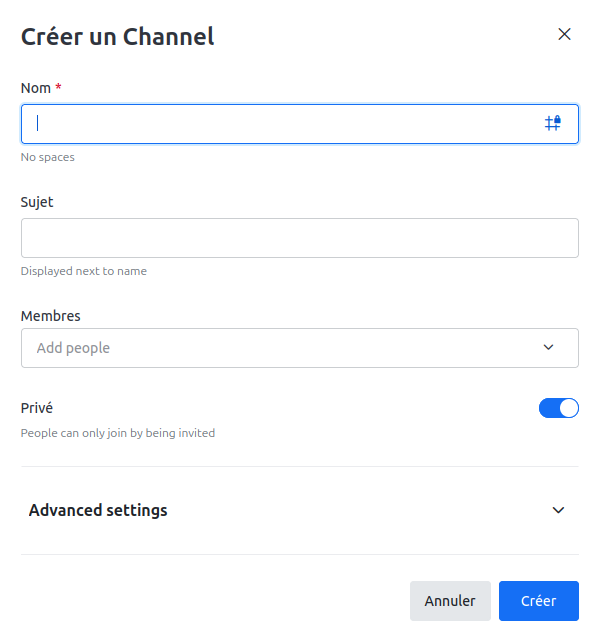

Entrez-y le nom que vous souhaitez donner à votre salon, le sujet du salon, ainsi que les autres membres que vous souhaitez inviter à y participer. Vous avez la possibilité de créer un salon public ou privé. Sur un salon public, tout le monde pourra participer. Sur un salon privé, seuls les utilisateurs que vous aurez invités pourront chatter avec vous.

Lorsque votre salon est prêt, il ne vous reste plus qu'à cliquer sur Créer.

## Chat

Lorsque vous rejoignez un salon existant, vous arrivez sur la fenêtre de chat : 

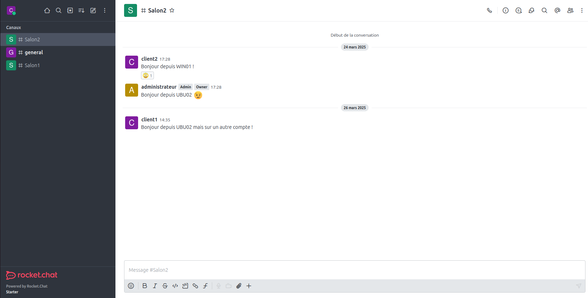

C'est ici que vous pouvez discuter avec les autres utilisateurs. Ici, vous pouvez envoyer du texte, des emojis, réagir aux messages des autres, et même envoyer des pièces jointes. 

# 3. Guide administrateur

## Connexion

Une fois connecté sur le site du serveur de chat, vous devriez vous trouver face à l'écran de connexion suivant :

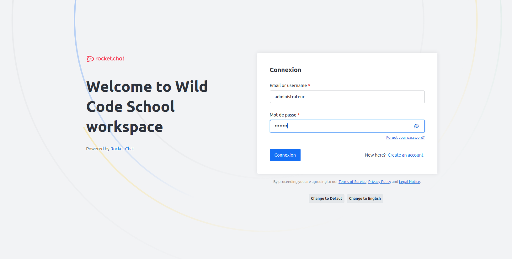

Vous pouvez y entrer votre identifiant ou votre adresse e-mail ainsi que votre mot de passe pour vous connecter.

Vous aurez ensuite accès à votre écran d'accueil administrateur :

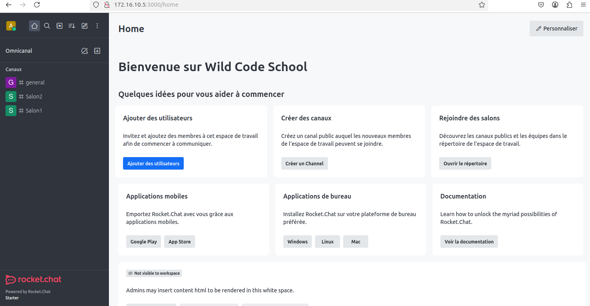

C'est ici que vous pourrez ajouter des utilisateurs, créer de nouveaux canaux, et gérer l'ensemble de votre serveur.

## Gestion des utilisateurs

Lorsque vous cliquez sur **Ajouter des utilisateurs** depuis votre écran d'accueil, vous êtes renvoyé sur la liste des utilisateurs présents sur le serveur :

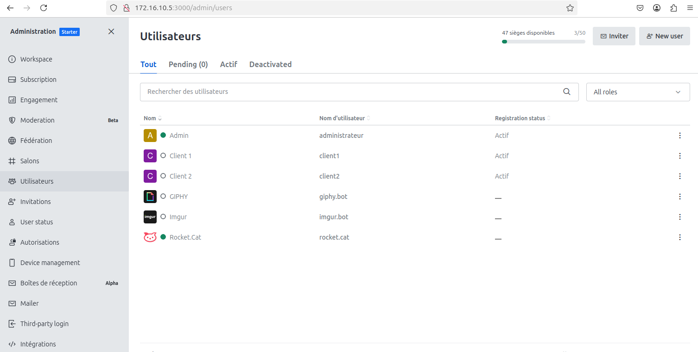

Pour ajouter un utilisateur, cliquez sur le bouton **New user**, en haut à droite.

Vous verrez alors apparaître une fenêtre de création d'utilisateur :

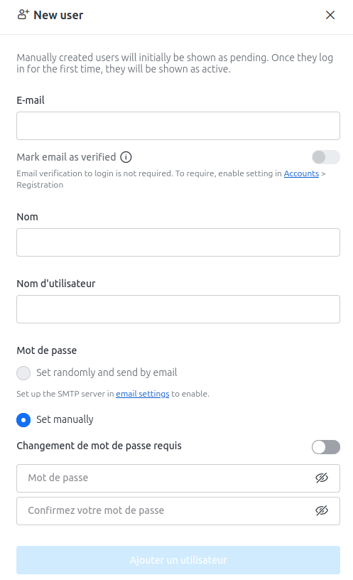

Vous devez y entrer l'adresse e-mail du nouvel utilisateur, son nom, et son nom d'utilisateur. Vous avez le choix de générer un premier mot de passe aléatoirement, ou de le définir vous-même. Lorsque vous êtes prêt, cliquez sur **Ajouter un utilisateur** pour valider l'opération.

Il est également possible de supprimer un utilisateur existant depuis la liste des utilisateurs :

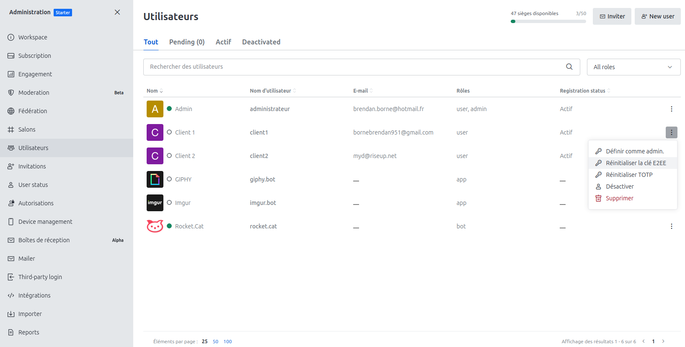

Lorsque vous êtes sur la liste des utilisateurs, vous pouvez cliquer sur les pointillés à droite du nom de l'utilisateur que vous souhaitez supprimer. Cliquez alors sur **Supprimer**. 

## Ajout de salon

Depuis votre écran d'accueil, cliquez sur **Créer un channel**. Vous verrez alors apparaître la fenêtre de création de salon suivante :

Entrez-y le nom que vous souhaitez donner à votre salon, le sujet du salon, ainsi que les autres membres que vous souhaitez inviter à y participer. Vous avez la possibilité de créer un salon public ou privé. Sur un salon public, tout le monde pourra participer. Sur un salon privé, seul les utilisateurs que vous aurez invités pourront participer.

## Ajouter des emojis personnalisés

Depuis votre écran d'accueil, cliquez sur **Personnaliser**, en haut à droite de la page. Dans la nouvelle fenêtre, choisissez l'option **Emoji** dans la liste des options à gauche.

Vous aurez alors un aperçu de la liste de vos emojis personnalisés :

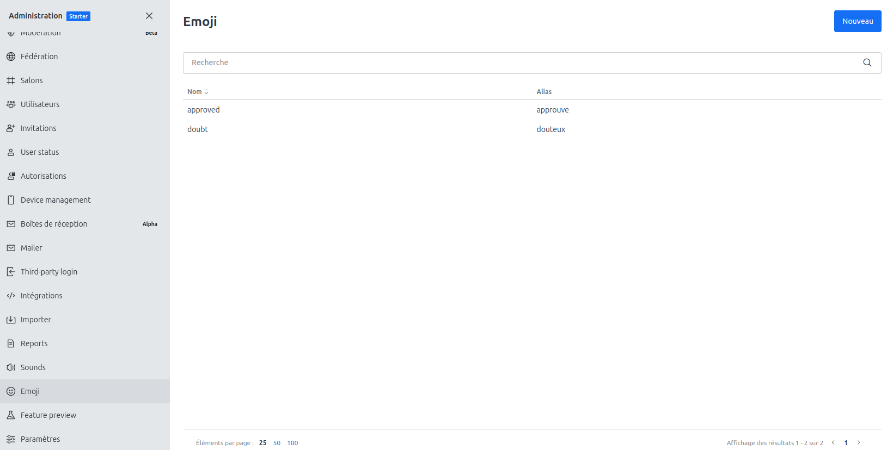

Afin d'ajouter un nouvel emoji, clique sur le bouton **Nouveau** en haut à droite. 

Vous verrez alors apparaître une une fenêtre d'ajout d'emoji : 

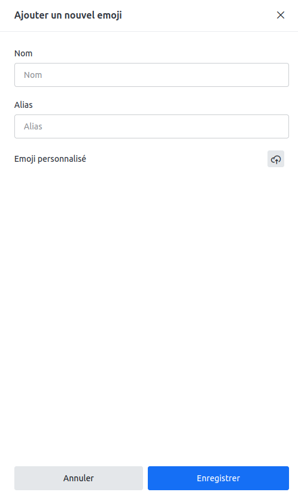

Donnez un nom et un alias à votre nouvel emoji, et uploadez sur le serveur l'image de base qui servira pour sa création. Lorsque vous êtes prêt, cliquez sur Enregistrer. Votre nouvel emoji est prêt.

# 4. FAQ

**Rocket.Chat est-il gratuit ?** 
 
Rocket.Chat est un logiciel Open Source proposant plusieurs gammes de prix. Pour une petite implémentation comme celle-ci, il est gratuit, mais il existe des options payantes pour personnaliser et gérer plus finement son serveur. 

**Peut-on personnaliser l'interface ?** 

Il est possible de personnaliser les couleurs de l'interface en modifiant le CSS de Rocket.Chat, ou en créant des scripts personnalisés en JavaScript. Certains plans Premium proposent également plus de personnalisation. 

**Peut-on passer d'un espace de travail à l'autre dans Rocket.Chat ?**

Oui. Il est possible d'avoir plusieurs espaces de travail différents au sein d'un même serveur, ou de se connecter à un serveur différent. 

**Peut-on accéder à son espace de travail via un appareil mobile ?** 

En théorie, oui. Mais cette implémentation ne permet que de se connecter via l'une des deux machines virtuelles client qui ont été créées. 

**Peut-on créer un espace de travail supplémentaire avec le même cloud ?**
Oui. Il est possible d'avoir plusieurs espaces de travail sur le même cloud. 

**Tous les utilisateurs peuvent-ils se connecter sur tous les salons ?**

Tout le monde peut se connecter aux salons publiques du serveur. Certains salons sont privés, et seuls les utilisateurs invités peuvent y participer. C'est au créateur du salon de choisir si son salon sera public ou privé. 

